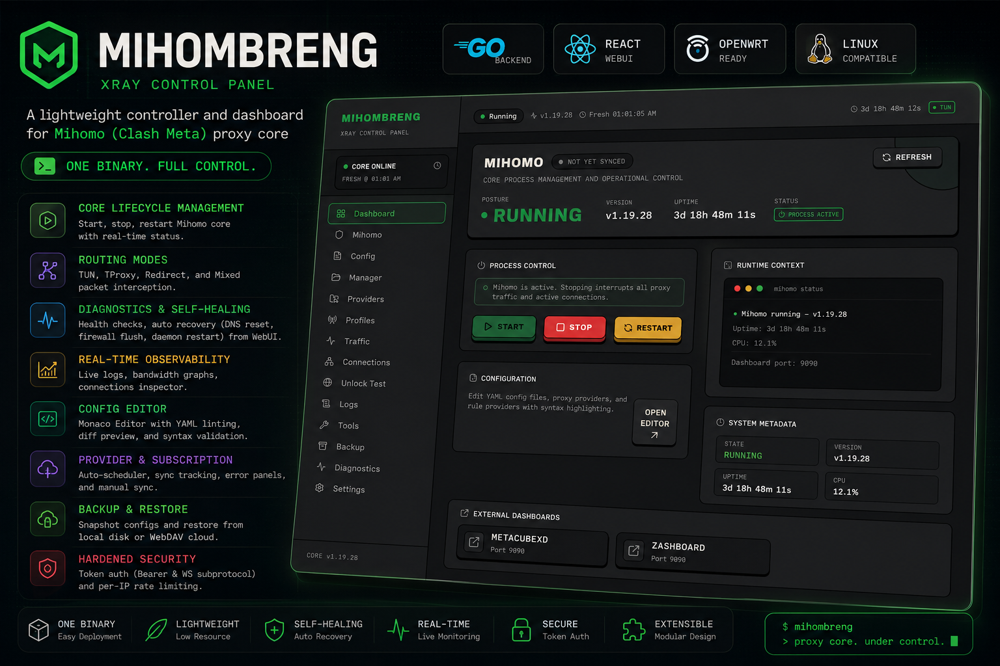
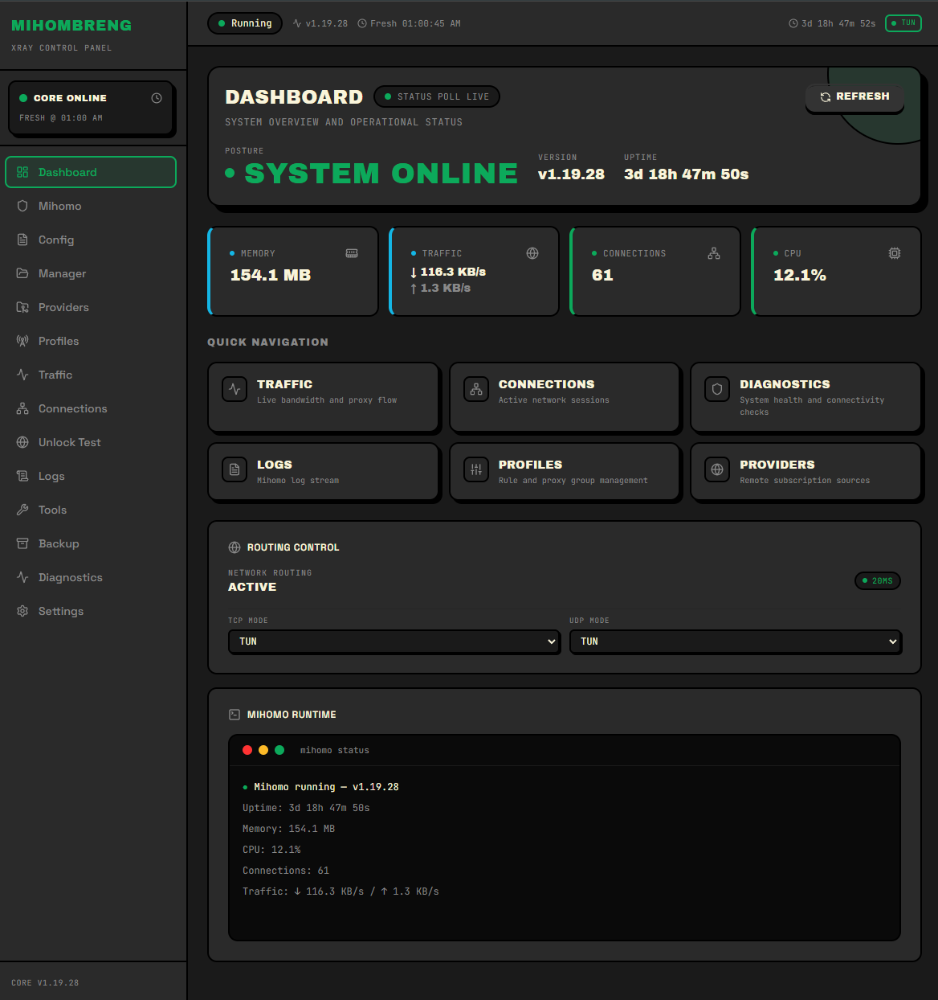
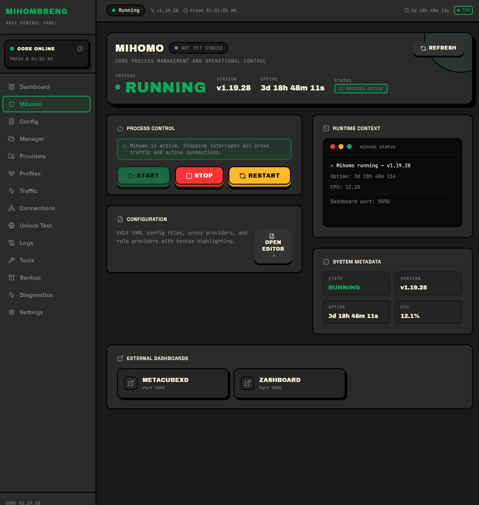
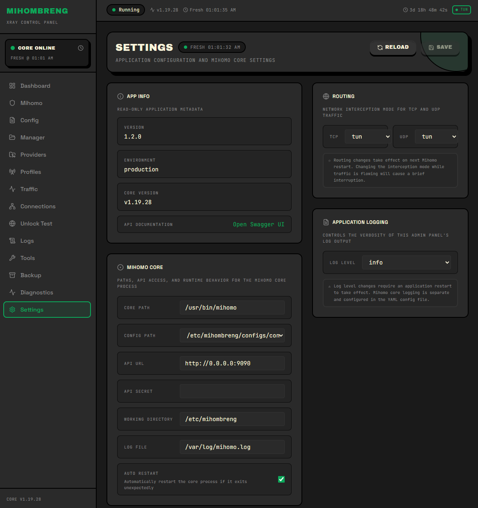

<div align="center">
  
</div>

# Mihombreng

A lightweight, high-performance controller and dashboard for the **Mihomo (Clash Meta)** proxy core on OpenWrt and Linux servers. It features a Go backend API with an embedded React WebUI served as a single compiled binary.

[](https://golang.org)
[](https://react.dev)
[](https://vite.dev)
[](https://tailwindcss.com)
[](https://openwrt.org)
[](LICENSE)

---

## ⚡ Key Features

*   **Core Lifecycle Management**: Start, stop, and restart the Mihomo core process programmatically with real-time process indicators.
*   **Routing Modes**: Seamless orchestration for transparent proxying including TUN, TProxy, Redirect, and Mixed packet interception.
*   **Diagnostics & Self-Healing**: Check host paths, filesystem permissions, DNS resolution, and TCP reachability. Self-heal via WebUI triggered automated recovery (DNS configurations reset, firewall flush, daemon restart).
*   **Real-Time Observability**:
    *   **Live Log Streaming**: High-efficiency WebSocket log stream with interactive search filter, pause controls, and multiple export formats (TXT, CSV, JSON).
    *   **Performance Graphs**: Interactive retro-brutalist bandwidth graphs (download/upload speed) using lightweight custom SVG lines, timeline zoom scales (1m, 2m, 5m), and rendering pause controls.
    *   **Connections Inspector**: Real-time traffic inspector displaying detailed routing paths, source IPs, DNS resolutions, and individual TCP flow termination controls.
*   **Config Editor**: Debounced YAML inline linting (squigglies), schema validation gates, and side-by-side Monaco DiffEditor comparison previews before changes are saved.
*   **Provider & Subscription Management**:
    *   **Auto-Scheduler**: Background task runner that periodically updates and pulls proxy profiles and rules subscriptions (daily, weekly, etc.) automatically.
    *   **File Inspector**: Detailed sync tracking with error indicator badges, sync error panels, and manual overrides.
*   **Backup & Restore**: Snapshot local configurations and restore history states from local disk or remote WebDAV cloud sync stores.
*   **Hardened Security**: Token authentication (Bearer & WebSocket subprotocol header authentication) and per-IP rate limiting security layers.
*   **Package Integration**: Configured packing scripts for Linux `systemd` and OpenWrt SDK (`procd` and LuCI package outputs).

---

## 📸 Screenshots

### Dashboard
<div align="center">
  
</div>

### Mihomo Core Status & Logs
<div align="center">
  
</div>

### Settings & Backups
<div align="center">
  
</div>

---

## 🚀 Quick Start

### Local Build

Compile both frontend and backend assets into a single static executable binary:

```bash
cd backend
make build
```

This pipeline automatically:
1. Builds the React production bundle in `web/`
2. Runs Go swagger documentation gen (`swag init`)
3. Embeds `web/dist` inside the backend assembly
4. Compiles the unified binary file at `backend/bin/mihombreng`

### Run Locally

Start the controller using the default configuration profile:

```bash
cd backend
./bin/mihombreng -c ../defaults/mihombreng.yaml
# Open your browser at http://localhost:7777
```

### Linux Redeployment

To build, install, and restart the systemd service on a remote target host:

```bash
cd /home/<user>/GITHUB/mihombreng/backend
make build
sudo install -m 755 bin/mihombreng /usr/share/mihombreng/mihombreng
sudo systemctl restart mihombreng
```

Verify service endpoint health and status responses:
```bash
# Check version endpoint
curl -i http://127.0.0.1:7777/api/v1/mihomo/api/version

# Query runtime status
curl http://127.0.0.1:7777/api/v1/mihomo/status
```

### OpenWrt Installation

Packaged `.ipk` files can be securely transferred and installed on your router:

```bash
scp mihombreng_*.ipk root@openwrt:/tmp/
ssh root@openwrt "opkg install /tmp/mihombreng_*.ipk"
```

For complete installation steps, troubleshooting tips, and packaging procedures, see the [docs/04-installation.md](docs/04-installation.md) guide.

---

## 📂 Project Structure

```text
mihombreng/
├── backend/                  Go backend (Gin REST API)
│   ├── cmd/server/           Main server entrypoint
│   ├── internal/
│   │   ├── http/
│   │   │   ├── handler/      Domain-specific route handlers (Mihomo, config, etc.)
│   │   │   ├── middleware/   CORS, authentication, rate limits
│   │   │   └── router/       API path declarations
│   │   ├── service/          Mihomo lifecycle, iptables, backup core processes
│   │   ├── domain/           Service interfaces
│   │   ├── converter/        Proxy subscription parser (vmess/vless/trojan/ss)
│   │   └── ui/               Embedded compiled React bundle
│   └── dist/                 Go production build target folder
├── defaults/                 Default configurations & YAML templates
├── deploy/
│   ├── docker/               Docker and Compose configuration setups
│   └── systemd/              Systemd unit file setups (Linux platform)
├── docs/                     Operational documentation and design metrics
├── scripts/                  Packaging and platform-specific helper scripts
└── Makefile                  Main packaging & deployment automation orchestration
```

---

## 📖 Documentation

Explore the detailed architecture and components of the Mihombreng controller:

*   📘 **[System Architecture](docs/01-architecture.md)** — Architectural diagrams, state machines, and lifecycle triggers.
*   🚦 **[API Reference](docs/02-api-reference.md)** — Complete OpenAPI specification documentation.
*   ⚛️ **[Frontend Workspace](docs/03-frontend.md)** — Layout rules, theme systems, and drawing controls.
*   💾 **[Deployment Guide](docs/04-installation.md)** — Installation checklists for Linux/OpenWrt target structures.
*   🗺️ **[Development Roadmap](docs/05-roadmap.md)** — Milestones, pending integrations, and design goals.

---

## 🛠️ Technology Stack

| Layer | Choice |
|---|---|
| **Backend API** | Go 1.24, Gin HTTP Router, Zerolog Structured Logs, Go-YAML |
| **Frontend UI** | React 19, Vite 7 (TSX), Tailwind CSS v4, Lucide Icons, Monaco Editor |
| **Proxy Core** | Mihomo (Clash Meta) Core Process Integration |
| **Deployment Platforms** | OpenWrt SDK (procd, nftables), Linux target platforms (systemd) |

---

## 📃 License

Distributed under the MIT License. See the [LICENSE](LICENSE) file for more information.
